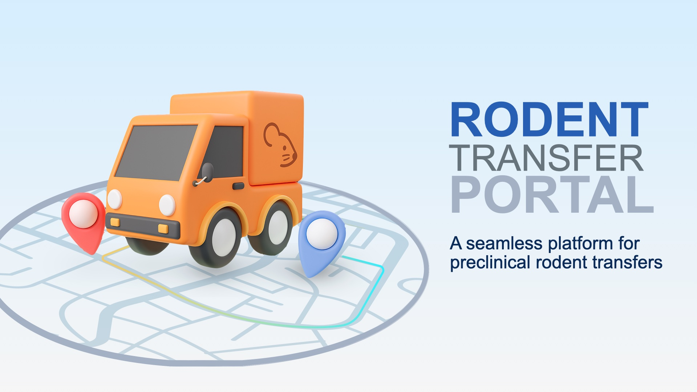

<p align="center">
  
</p>


# Rodent Transfer Portal

A **Streamlit web application** designed to manage and submit rodent transfer requests between the **Centre for Comparative Medicine (CCM)** located at UBC and other research facilities on- and off-Campus. 
The portal streamlines the documentation workflow, automatically generates PDF transfer forms, and sends confirmation emails to facility staff and requesters.

---

## Features

- Secure access verification (authorized users only)  
- Upload and attach supporting documents (monitoring sheets, cage maps, etc.)  
- Automatic PDF form generation  
- Email notifications for both the requester and facility  

---

## Running Locally

1. **Clone this repository**
   ```bash
   git clone https://github.com/<yourusername>/rodent-transfer-portal.git
   cd rodent-transfer-portal

   python3 -m venv myenv
   source myenv/bin/activate
   pip install -r requirements.txt
   streamlit run Transfer.py

---

## Credits

Developed by Cristina Rodriguez-Rodriguez, PhD.  
for the Molecular Imaging Research Facility at the University of British Columbia.

©2025 – Cristina Rodriguez. All rights reserved.
